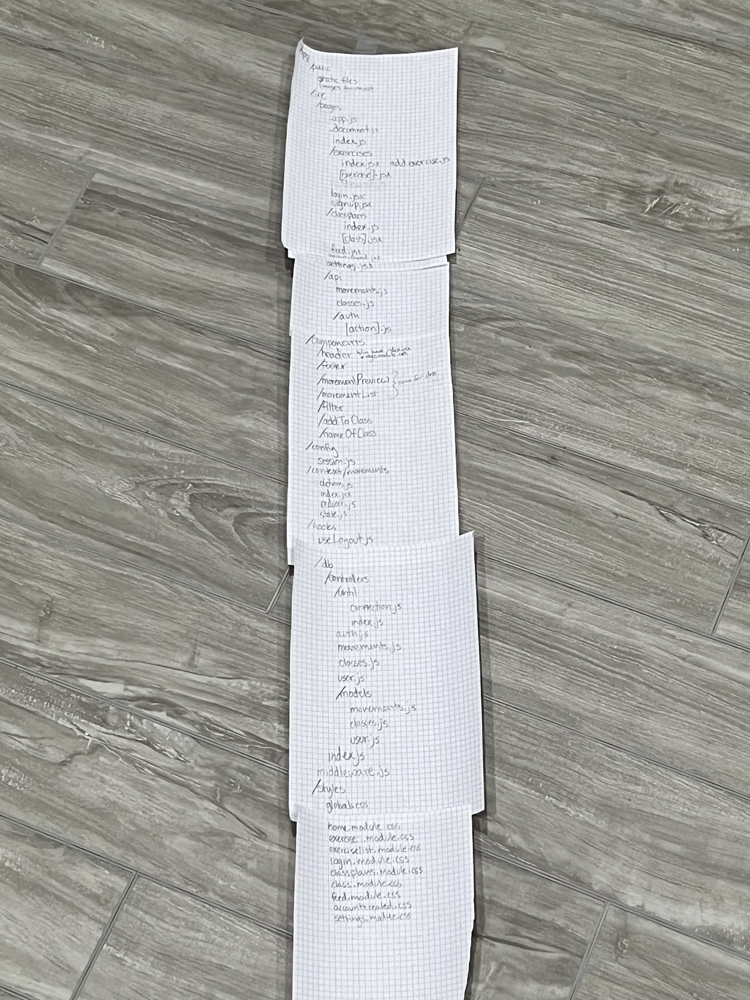

This is a [Next.js](https://nextjs.org/) project bootstrapped with [`create-next-app`](https://github.com/vercel/next.js/tree/canary/packages/create-next-app). It is built for Yoga Instructors to organize and plan their classes.

## Purpose and Inspiration

This project was origionally intended for pilates instructos, but because of time and lack of available api's it became intended for yoga intructors. It is intended to be a tool for creating class plans.

When I first started this project I wanted a way to store movements in a sensible fashion for class organization. As a Pilates instructor organization is important. I noticed there weren't any apps out there for organizing class plans so thought this would be the perfect addition.

Beyond hundreds of post its, I created the following origional file set up and wireframe of the app:

## Technology Used

- This yoga api: https://github.com/alexcumplido/yoga-api
- MongoDB

## Next Steps

The next steps in this project are to further implement the features for adding, removing, updating, etc. I would also like to shift it to Pilates as it was my initial intention.
Adding creative elements and styling is also a desire.

## Contributing

Feel free to open issues in this repo! When you solve an issue make sure to for the repo, and create a new branch. Once you've implemented changes, commit and submit a pull request including a description.
